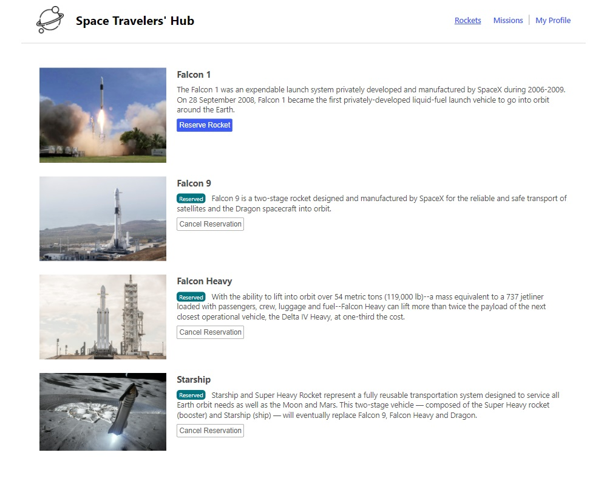
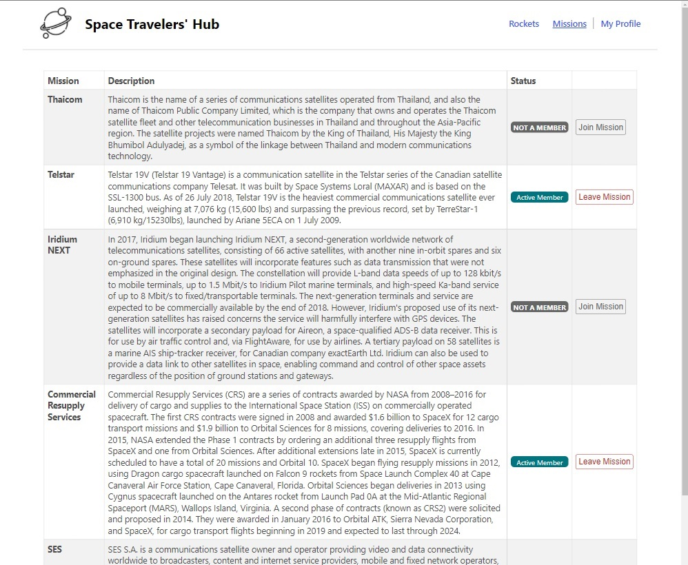
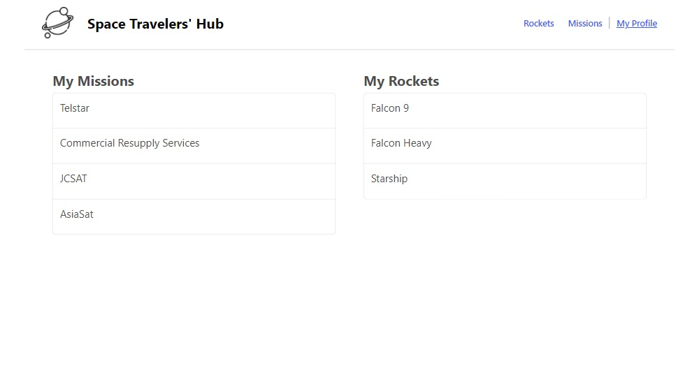

# Space-Travelers-Hub
Space-Travelers-Hub is a web application displaying real live data from the SpaceX API. Allows users to book rockets and join selected space missions.
  
## Live Demo

[Live Demo Link](https://tmampa.github.io/space-x/) --- update link!!!

## Screenshots
### Desktop



## Built With

- HTML, CSS
- JavaScript
- React.JS
- Redux

## Getting Started

**To clone this project run command:**
```
$git clone https://github.com/tmampa/space-x.git
```
**or press the green Code button in the upper right corner and choose to download from the Download ZIP link.**

### Install

```cmd
npm install
```

### Usage

```cmd
npm start
```

## Prerequisites

- Code editor (VS Code, Sublime, Atom)
- Node.JS

## Authors

👤 **Author1**

- GitHub: [@M0rrighan](https://github.com/M0rrighan)
- Twitter: [@RadmilaStojceva](https://twitter.com/RadmilaStojceva)
- LinedIn: [@Radmila Stojceva](https://www.linkedin.com/in/radmila-stojceva-71a838212)

👤 **Author2**
- GitHub: [tmampa](https://github.com/tmampa)
- LinkedIn: [Tshephang Mampa](https://linkedin.com/tshephangmampa)
- Twitter: [Tshephangm\_](https://twitter.com/tshephangm_)

## Show your support

Give a ⭐️ if you like this project!


## Acknowledgements

Logo Icon [attribution link](https://www.flaticon.com/free-icons/planet)
## 📝 License

This project is [MIT](./MIT.md) licensed.
